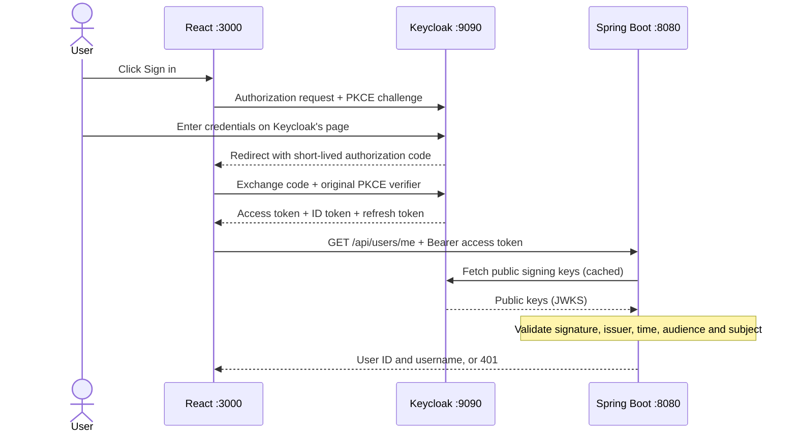

# Keycloak login: step-by-step walkthrough

This branch now follows the Keycloak architecture in [Ali Bouali's book-social-network](https://github.com/ali-bouali/book-social-network/tree/main), adapted to React and Spring Boot 4.1.1. The reference frontend is Angular; this project stays React.

**Start here:** read steps 1–6, run the app, then explain the numbered diagram to your senior. Open `docs/KEYCLOAK_FLOW.excalidraw` in Excalidraw using **Open** to edit the diagram.

## 1. Understand the change

Previously, React sent passwords to our API. `AuthService` checked a BCrypt hash in H2, `JwtService` signed a JWT with a shared secret, and `JwtAuthenticationFilter` checked it on later requests.

Now Keycloak stores users, handles passwords, displays the login/registration pages, and signs tokens. React uses the official `keycloak-js` adapter. Spring Boot is an **OAuth2 resource server**: it protects the API and verifies access tokens. It never receives the user's password.

OAuth2 describes access to a resource. **OpenID Connect (OIDC)** adds identity/login on top of OAuth2. **JWT** is the signed token format. Keycloak is the server implementing those protocols. We use **Authorization Code flow with PKCE**.

The old auth controller/service, homemade JWT filter/service, password entity/repository and unused JJWT/JPA/H2 dependencies were removed. The old implementation remains in Git history. Existing H2 accounts are not migrated; use the imported Keycloak demo user or register a new account.

## 2. Start the three applications

Open three terminals in the repository root.

### Terminal 1: Keycloak on Windows (no Docker required)

```powershell
powershell -NoProfile -ExecutionPolicy Bypass -File scripts/start-keycloak.ps1
```

The script downloads pinned Keycloak 26.8.0, verifies its SHA-256 checksum, extracts it into ignored `.local/`, copies the realm import and starts Keycloak on port 9090. This setup has been run with the installed Java 21. It does not change your system Java installation.

If you have Docker instead, use the alternative below. Do not start both on port 9090.

```powershell
docker compose up -d keycloak
```

Both options import `keycloak/jwt-login-realm.json`. Native users/data persist inside `.local/keycloak-26.8.0/data`; Docker data persists in the named volume. **Startup import skips an existing realm.** Editing the JSON alone will not update an already-running/imported realm. Apply that change in the admin console too; do not delete your realm if you need its users.

### Terminal 2: Spring Boot API

```powershell
.\mvnw.cmd spring-boot:run
```

The API runs at `http://localhost:8080`. It can start without Keycloak because the public-key URL is configured explicitly; authenticated calls still need access to Keycloak's public keys initially.

### Terminal 3: React

```powershell
cd src/frontend
npm ci
npm start
```

Open **http://localhost:3000/**. Use `localhost` consistently; `127.0.0.1:3000` is a different browser origin and is not registered as a redirect URI.

| Purpose | Username | Password |
| --- | --- | --- |
| Application demo | `alice` | `Alice-demo-123!` |
| Local Keycloak admin | `admin` | `local-admin-change-me` |

Admin console: `http://localhost:9090/admin/`. Select the `jwt-login` realm to inspect its clients and users. These published credentials and `start-dev` are for this local demonstration only. A production setup needs HTTPS, managed secrets, and a production database.

## 3. Understand the realm and client

Read `keycloak/jwt-login-realm.json` from top to bottom:

- `realm: jwt-login`: an isolated collection of users, clients and login settings.
- `registrationAllowed`: makes Keycloak's registration page available.
- `accessTokenLifespan: 300`: access tokens last five minutes.
- `clientId: jwt-login-react`: identifies our browser application.
- `publicClient: true`: browser JavaScript cannot keep a client secret, so it has none.
- `standardFlowEnabled: true`: enables Authorization Code flow.
- `implicitFlowEnabled: false`: tokens are not handed to the app through the old implicit flow.
- `directAccessGrantsEnabled: false`: React cannot exchange a raw username/password directly for tokens. It must use the login redirect.
- `redirectUris`: Keycloak may return only to `http://localhost:3000/` for this demo.
- `webOrigins`: permits the React origin to call Keycloak's token endpoint. This is separate from the API's CORS setting.
- `pkce.code.challenge.method: S256`: requires the code exchange to prove possession of the original verifier.
- `post.logout.redirect.uris`: allows returning to React after logout.
- `defaultClientScopes`: `basic` supplies the subject/user ID; `profile` supplies readable identity claims; `email` supplies email claims; `web-origins` supplies origin information. The live test caught the missing `basic` scope during implementation.
- `api-audience` mapper: adds `jwt-login-api` to the access token's `aud` claim. This tells the API the token was intended for it. It is not added to the ID token.
- `users`: seeds Alice with a local demo password and no forced first-login password change.

In the admin console, inspect **Clients → jwt-login-react → Settings**, **Client scopes**, and the client's audience mapper. We do not copy the reference project's `account` role mapping: this demo has no role-protected endpoints. Every authenticated user may fetch their own identity.

## 4. Follow the login, one request at a time



**PKCE:** the adapter creates a random verifier and sends its SHA-256 challenge with the first redirect. At token exchange it sends the verifier. Keycloak checks the pair. Stealing an authorization code alone is not enough to redeem it. The adapter also handles the protocol's state/nonce checks.

**Three token types:** the access token goes to the API; the ID token describes the login to the client; the refresh token goes only to Keycloak to obtain a new access token. Never send an ID token as the API's Bearer credential.

**Signature:** Keycloak holds the private signing key. The API downloads public keys from its JWKS endpoint and caches them. The API can verify tokens but cannot mint a token using those public keys. It does not call Keycloak to check a password on each request.

**Claims:** `iss` is the issuing realm, `aud` is the intended recipient, `sub` is the stable user ID, `exp` is expiry, and `preferred_username` is the readable username. Decoding these fields alone does not validate the signature.

## 5. Explain the Java code

### `pom.xml`

`spring-boot-starter-security-oauth2-resource-server` brings in Spring's Bearer-token handling and JWT verification. The Web MVC starter supplies REST endpoints. Test dependencies keep JUnit and Cucumber available. Maven uses the Spring Boot parent to choose compatible Spring versions.

### `application.properties`

`issuer-uri` restricts tokens to our realm. `jwk-set-uri` supplies the public signing-key location. `audiences=jwt-login-api` rejects tokens meant for other APIs. The optional `KEYCLOAK_ISSUER` environment variable changes the realm URL. `FRONTEND_ORIGIN` sets the one allowed React origin.

### `SecurityConfig.java`

- `@Configuration` makes this a source of Spring beans; `@Bean` registers each returned object.
- `@EnableWebSecurity` explicitly enables web security infrastructure. Boot already enables it in this setup.
- `SecurityFilterChain` specifies which filters and access rules apply before controllers run.
- `cors(...)` uses our origin/method/header rules. A preflight can pass without a token; a protected GET cannot.
- `csrf(...disable())` matches an API authenticated solely by explicitly attached Bearer headers. Reconsider this if the API later authenticates using browser cookies.
- `STATELESS` prevents Spring from persisting login in an HTTP session. Keycloak still has its own SSO session.
- `/error` is public so errors can be rendered. All other requests require authentication.
- `oauth2ResourceServer(...jwt...)` installs Spring's standard Bearer-token authentication, replacing our custom filter.
- `JwtAuthenticationConverter` turns the verified JWT into Spring's `Authentication` object and uses `preferred_username` as its display name.
- The small subject check rejects tokens without a user ID with 401. Signature, issuer, time and audience are validated by the decoder before conversion.
- `CorsConfigurationSource` permits GET/OPTIONS and the Authorization header from our frontend origin.

### `UserController.java`

`@RestController` returns JSON. `@RequestMapping` plus `@GetMapping` defines `GET /api/users/me`. `@AuthenticationPrincipal Jwt` injects the already-validated token. The endpoint returns `sub` as `id` and `preferred_username` as `username`, falling back to `sub` if a username is absent. Use the stable ID to link future application data to the user.

## 6. Explain the React code

### `auth.js`

One Keycloak instance holds configuration and tokens. `initAuth()` caches its promise because React StrictMode can run effects twice. It removes the legacy localStorage JWT and runs `check-sso`: restore an existing Keycloak session or show the signed-out screen. `login()`, `register()` and `logout()` redirect to Keycloak. `getAccessToken()` calls `updateToken(30)` before an API request; if less than 30 seconds remain, the adapter refreshes it. Failed refresh clears the token and reports a 401-style error to the UI.

Access and refresh tokens remain in adapter memory. A page reload restores login through Keycloak's session, rather than loading a token from localStorage. `checkLoginIframe: false` avoids relying on a third-party session iframe; another tab's logout is noticed when authentication/refresh is next checked.

### `api.js`

`fetchProfile()` waits for a usable access token, sets `Authorization: Bearer ...`, and calls the API. It preserves HTTP status codes so the UI can distinguish an expired session from a network/server problem.

### `App.js` and `Profile.js`

`App` tracks loading, signed-out, signed-in and connection-failure states. It offers Keycloak login and registration. `Profile` fetches identity, offers retry for failures, re-login for 401, and Keycloak logout. Both effects ignore late results after unmounting. Raw token strings are not displayed in the UI.

Logout ends the Keycloak SSO session and prevents normal refresh. An already-issued access token can remain valid until its five-minute expiry because this API validates JWTs locally; immediate revocation would require a different design such as introspection or a revocation mechanism.

## 7. Run and explain the tests

```powershell
.\mvnw.cmd test
npm test --prefix src/frontend -- --watchAll=false
npm run build --prefix src/frontend
```

Cucumber lives in `src/test/resources/features/login.feature`. **Given** sets up a token, **When** calls the real HTTP endpoint, and **Then** checks the response. `LoginSteps.java` binds the Gherkin sentences to Java methods. `CucumberTest` selects the feature files; `CucumberSpringConfiguration` starts the app on a random port.

`JwtTestSupport` creates an RSA keypair and a tiny public-key HTTP endpoint for the test run. It signs test tokens and points the real Spring decoder at that endpoint. No authentication result is mocked. These tests validate our API's security contract; they do not test Keycloak's own password screen.

The suite covers valid identity, missing token, malformed token, expired token, wrong signature, wrong issuer, wrong audience, missing subject, allowed/disallowed CORS, and the retired auth routes. There are 12 Cucumber cases plus the context test. React has 11 tests covering redirects, profile/error states, singleton initialization, refresh and Bearer headers.

For the real browser smoke test, start all three apps and install the isolated test runner once:

```powershell
npm install --prefix .local/browser --save-exact playwright-core@1.63.0
node scripts/check-keycloak.cjs
```

This uses installed Chrome in an isolated headless profile. It checks PKCE/code flow, wrong password, successful login, API access, refresh, reload, logout and self-registration. Each run creates one `smoke-...` user in the local realm. Screenshots go into ignored `.local/`; no tokens are saved. This is separate from the self-contained Cucumber suite.

## 8. Map this project to the reference

| Reference project | This project | Responsibility |
| --- | --- | --- |
| `docker-compose.yml` and `keycloak/realm` | `docker-compose.yml`, `keycloak/jwt-login-realm.json` | Run and configure Keycloak |
| `book-network/.../security/SecurityConfig.java` | `src/main/java/com/example/demo/config/SecurityConfig.java` | Resource server and API rules |
| `book-network/.../application-dev.yml` | `src/main/resources/application.properties` | Trusted issuer |
| `book-network-ui/.../keycloak/keycloak.service.ts` | `src/frontend/src/auth.js` | Browser login/session adapter |
| `book-network-ui/.../interceptor/http-token.interceptor.ts` | `src/frontend/src/api.js` | Attach access token |
| Angular application initialization/guard | React `App.js` | Initialize auth and display appropriate screen |

We followed the architecture and wrote a smaller implementation for this app. The reference uses an older Keycloak release and Angular, so version-specific configuration and framework code differ.

## A short explanation for your senior

> I moved identity management into Keycloak. React is a public OIDC client using Authorization Code flow with PKCE. Keycloak handles registration and login and gives React an access token. React keeps tokens in memory, refreshes before API calls and sends the access token as a Bearer header. Spring Boot is a stateless resource server that verifies the signature against Keycloak's public keys and checks issuer, audience and expiry before returning the user's profile. Cucumber verifies the API security rules, and a separate real-browser test verifies the login flow.

Sources: [reference security configuration](https://github.com/ali-bouali/book-social-network/blob/main/book-network/src/main/java/com/alibou/book/security/SecurityConfig.java), [reference frontend service](https://github.com/ali-bouali/book-social-network/blob/main/book-network-ui/src/app/services/keycloak/keycloak.service.ts), [Keycloak JavaScript adapter](https://www.keycloak.org/securing-apps/javascript-adapter), [Spring JWT resource server](https://docs.spring.io/spring-security/reference/servlet/oauth2/resource-server/jwt.html), [realm import](https://www.keycloak.org/server/importExport).
